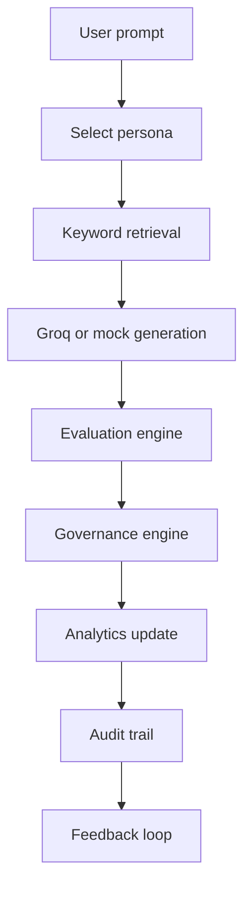

# Lumen - AI Conversation Studio

Lumen is an enterprise-grade AI Conversation Studio for testing, evaluating, governing, and continuously improving AI assistants before production deployment.

It was built for Challenge 4 - AI Conversation Studio of the 22North Product Engineering Challenge 2026.

The product is not a generic chatbot. It is a lightweight control center for AI teams that need visibility into answer quality, knowledge grounding, unsupported claims, governance risk, feedback, and evaluation history.

## Product Thesis

Organizations are deploying AI assistants across HR, IT, Security, Legal, and Support, but most teams cannot confidently answer:

- Why did the assistant generate this response?
- Which policy documents supported it?
- Which claims were unsupported?
- Did the response violate governance rules?
- Should this assistant behavior be trusted or reviewed?

Lumen's core principle is:

> Explainability before trust.

Every test run follows a transparent pipeline:

1. User writes a prompt.
2. User selects a persona.
3. Lumen retrieves relevant knowledge.
4. The LLM generates a response.
5. Lumen evaluates groundedness and claims.
6. Governance rules approve or flag the response.
7. Feedback updates analytics.
8. The run is stored in an audit trail.

## Current MVP

The implemented MVP focuses on one complete workflow instead of many incomplete pages.

Implemented:

- Prompt Studio workspace
- Persona selection: Support, HR, IT, Security
- Mock enterprise knowledge base
- Keyword retrieval
- Groq-backed generation through a provider abstraction
- Mock fallback generation when `GROQ_API_KEY` is unavailable
- Evaluation engine for groundedness, confidence, supported claims, unsupported claims, and reasoning
- Governance checks for low groundedness, PII, toxicity, and unsupported claims
- Feedback submission
- Analytics snapshot
- Audit trail
- Responsive navigation:
  - Mobile bottom navigation
  - Tablet rail sidebar
  - Desktop expanded sidebar
  - Logo-based collapse/expand control
- Monochrome Liquid Glass enterprise UI

## Tech Stack

| Layer | Technology |
| --- | --- |
| Framework | Next.js 15 App Router |
| UI | React 19, TypeScript |
| Styling | Tailwind CSS 4 |
| Icons | Lucide React |
| Charts | Chart.js, react-chartjs-2 |
| AI Provider | Groq SDK |
| Backend | Next.js Route Handlers |
| Storage | In-memory session store for MVP |

## Repository Structure

```text
src/
  app/
    api/conversation/route.ts      API route for generation, feedback, analytics
    globals.css                    Liquid Glass design language
    layout.tsx                     Fonts and metadata
    page.tsx                       App entry
  components/
    analytics/                     Analytics panel
    prompt-studio/                 Primary product workspace
    ui/                            Reusable glass card and badge primitives
  constants/
    knowledge.ts                   Mock policy documents
    personas.ts                    Persona system prompts
  lib/
    utils.ts                       Shared helpers
  services/
    analytics/                     In-memory store and metrics aggregation
    evaluation/                    Heuristic fallback evaluator
    governance/                    Policy and risk checks
    groq/                          Provider abstraction
    retrieval/                     Keyword retrieval
  types/
    lumen.ts                       Domain types
docs/
  API_DOCUMENTATION.md
  ARCHITECTURE.md
  DB_DESIGN.md
  SOLUTION_DESIGN.md
  TEST_DATA.md
```

## Getting Started

Install dependencies:

```bash
npm install
```

Run the development server:

```bash
npm run dev
```

Open:

```text
http://localhost:3000
```

Build for production:

```bash
npm run build
```

Start production preview:

```bash
npm run start
```

Run lint:

```bash
npm run lint
```

## Environment Variables

Create `.env.local` for real Groq generation:

```env
GROQ_API_KEY=your_groq_api_key
GROQ_MODEL=llama-3.3-70b-versatile
```

If `GROQ_API_KEY` is not set, Lumen uses deterministic mock generation and heuristic evaluation. This makes the app demoable without external credentials.

## Primary Workflow



## Key Design Decisions

- **Depth over breadth:** The MVP implements one complete end-to-end evaluation workflow.
- **Provider abstraction:** UI never calls Groq directly. Provider changes should remain backend-only.
- **Explainability-first UI:** Retrieved evidence, supported claims, unsupported claims, and governance status are visible in the same workflow.
- **Mock fallback:** Judges and developers can test without API keys.
- **Strict grayscale design:** Semantic colors are used only for approval, warning, and risk states.
- **In-memory storage:** Chosen for MVP speed. The DB design document defines the production Postgres model.

## Documentation

- [API Documentation](docs/API_DOCUMENTATION.md)
- [Architecture Documentation](docs/ARCHITECTURE.md)
- [Database Design](docs/DB_DESIGN.md)
- [Solution Design Document](docs/SOLUTION_DESIGN.md)
- [Test Data](docs/TEST_DATA.md)
- [Prompt Test Cases](docs/test-data/prompt-cases.json)
- [Sample Conversation Runs](docs/test-data/sample-runs.json)

## Demo Prompts

Use these to exercise different paths:

```text
Can I paste customer PII into an external AI tool to summarize a support ticket?
```

```text
Can I expense a new vendor tool that costs $1,200 and includes customer PII?
```

```text
How many days in advance should I request PTO?
```

```text
Do I need VPN when accessing internal tools from hotel Wi-Fi?
```

## Production Roadmap

- PostgreSQL persistence
- Authentication and RBAC
- Multi-tenant workspaces
- Vector search
- Prompt versioning
- Human review queue
- Evaluation datasets
- Multi-provider comparison
- Streaming responses
- Cost and latency analytics
- Deployment environments and approval gates

## Current Limitations

- Session state is in memory and resets on server restart.
- Retrieval is keyword-based, not semantic.
- Governance rules are deterministic and intentionally simple.
- The current UI is a single-workflow studio, not a full multi-page product.
- Real LLM evaluation requires `GROQ_API_KEY`.

## Verification

Known passing commands:

```bash
npm run lint
npm run build
```
