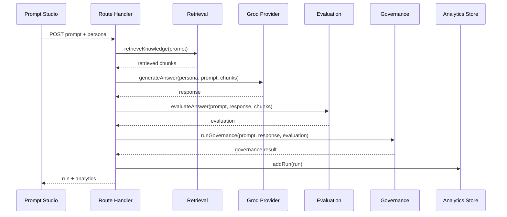

# Lumen API Documentation

## Overview

Lumen currently exposes one consolidated route for the MVP workflow:

```text
/api/conversation
```

The route supports:

- Analytics retrieval
- Prompt execution
- Feedback submission

All requests and responses use JSON.

## Authentication

MVP status: unauthenticated.

Production recommendation:

- Use organization-scoped authentication.
- Add RBAC for evaluator, reviewer, admin, and auditor roles.
- Require tenant/workspace IDs on all write operations.
- Store immutable audit events for regulated workflows.

## Base URL

Local:

```text
http://localhost:3000
```

Production example:

```text
https://lumen.example.com
```

## Domain Types

### PersonaId

```ts
type PersonaId = "support" | "hr" | "it" | "security";
```

### RetrievedChunk

```json
{
  "documentId": "security-standards",
  "title": "Security Standards",
  "excerpt": "Confidential data must be encrypted...",
  "relevance": 98,
  "tags": ["security", "pii", "data"]
}
```

### EvaluationResult

```json
{
  "groundedness": 84,
  "confidence": 82,
  "supportedClaims": ["PII must not be pasted into external AI tools"],
  "unsupportedClaims": ["Escalate anything not covered by sources"],
  "reasoning": "Score reflects overlap between the answer and retrieved policy evidence."
}
```

### GovernanceResult

```json
{
  "status": "approved",
  "flags": [],
  "reviewerStatus": "auto-approved",
  "summary": "The response is clear for controlled testing."
}
```

## GET /api/conversation

Returns the current analytics snapshot.

### Request

```http
GET /api/conversation
```

### Response 200

```json
{
  "analytics": {
    "totalTests": 1,
    "averageGroundedness": 84,
    "positiveFeedback": 0,
    "negativeFeedback": 0,
    "flagRate": 0,
    "topPersonas": [
      { "persona": "security", "count": 1 }
    ],
    "groundednessTrend": [84],
    "flagsByCategory": [
      { "category": "Grounding", "count": 0 },
      { "category": "PII", "count": 0 },
      { "category": "Claims", "count": 0 }
    ]
  }
}
```

## POST /api/conversation - Run Prompt

Executes the complete AI evaluation workflow.

### Request

```http
POST /api/conversation
Content-Type: application/json
```

```json
{
  "prompt": "Can I paste customer PII into an external AI tool?",
  "persona": "security"
}
```

### Processing Flow



### Response 200

```json
{
  "run": {
    "id": "8d348484-efb0-4abb-8ce0-57a5a943d91c",
    "timestamp": "2026-07-02T15:04:36.099Z",
    "persona": "security",
    "prompt": "Can I paste customer PII into an external AI tool?",
    "response": "Based on the available Security knowledge...",
    "retrieved": [
      {
        "documentId": "security-standards",
        "title": "Security Standards",
        "excerpt": "Confidential data must be encrypted...",
        "relevance": 98,
        "tags": ["security", "pii", "data"]
      }
    ],
    "evaluation": {
      "groundedness": 84,
      "confidence": 82,
      "supportedClaims": ["PII must not be pasted into external AI tools"],
      "unsupportedClaims": [],
      "reasoning": "Score reflects overlap between the answer and retrieved policy evidence."
    },
    "governance": {
      "status": "approved",
      "flags": [],
      "reviewerStatus": "auto-approved",
      "summary": "The response is clear for controlled testing."
    },
    "latencyMs": 11,
    "model": "llama-3.3-70b-versatile"
  },
  "analytics": {
    "totalTests": 1,
    "averageGroundedness": 84,
    "positiveFeedback": 0,
    "negativeFeedback": 0,
    "flagRate": 0,
    "topPersonas": [
      { "persona": "security", "count": 1 }
    ],
    "groundednessTrend": [84],
    "flagsByCategory": [
      { "category": "Grounding", "count": 0 },
      { "category": "PII", "count": 0 },
      { "category": "Claims", "count": 0 }
    ]
  }
}
```

### Error 400

Returned when the prompt is empty.

```json
{
  "error": "Prompt is required."
}
```

## POST /api/conversation - Submit Feedback

Updates feedback for an existing run and returns updated analytics.

### Request

```json
{
  "runId": "8d348484-efb0-4abb-8ce0-57a5a943d91c",
  "feedback": "positive"
}
```

Allowed feedback values:

```text
positive
negative
```

### Response 200

```json
{
  "analytics": {
    "totalTests": 1,
    "averageGroundedness": 84,
    "positiveFeedback": 1,
    "negativeFeedback": 0,
    "flagRate": 0,
    "topPersonas": [
      { "persona": "security", "count": 1 }
    ],
    "groundednessTrend": [84],
    "flagsByCategory": [
      { "category": "Grounding", "count": 0 },
      { "category": "PII", "count": 0 },
      { "category": "Claims", "count": 0 }
    ]
  }
}
```

## cURL Examples

Run a prompt:

```bash
curl -X POST http://localhost:3000/api/conversation \
  -H "Content-Type: application/json" \
  -d "{\"prompt\":\"Can I paste customer PII into an external AI tool?\",\"persona\":\"security\"}"
```

Get analytics:

```bash
curl http://localhost:3000/api/conversation
```

Submit feedback:

```bash
curl -X POST http://localhost:3000/api/conversation \
  -H "Content-Type: application/json" \
  -d "{\"runId\":\"RUN_ID\",\"feedback\":\"positive\"}"
```

## Future API Surface

| Endpoint | Purpose |
| --- | --- |
| `GET /api/personas` | List available assistants |
| `POST /api/personas` | Create persona |
| `GET /api/knowledge` | Browse documents |
| `POST /api/knowledge` | Upload document |
| `POST /api/evaluations/batch` | Evaluate datasets |
| `GET /api/runs` | Query run history |
| `GET /api/runs/:id` | Inspect a run |
| `POST /api/reviews/:id/approve` | Human approval |
| `POST /api/reviews/:id/reject` | Human rejection |
