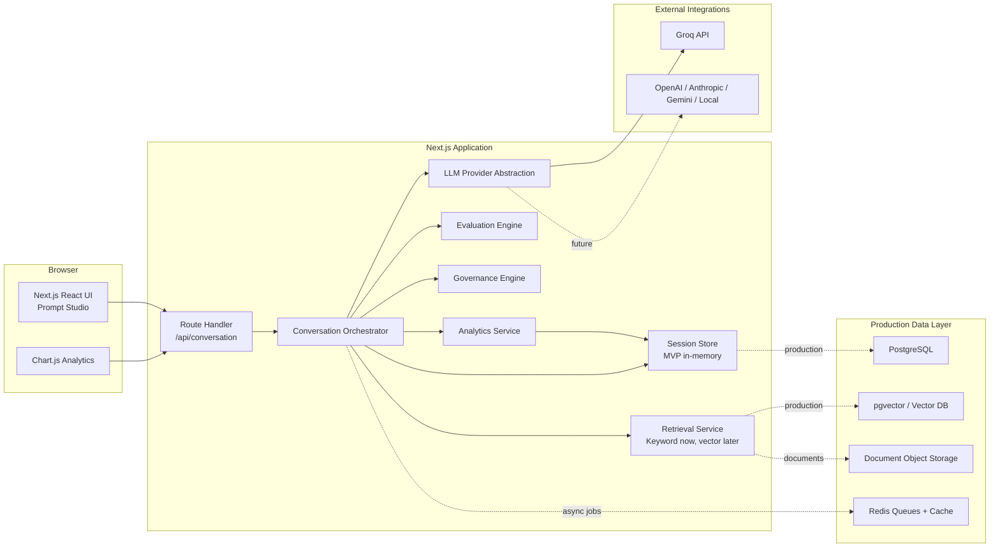
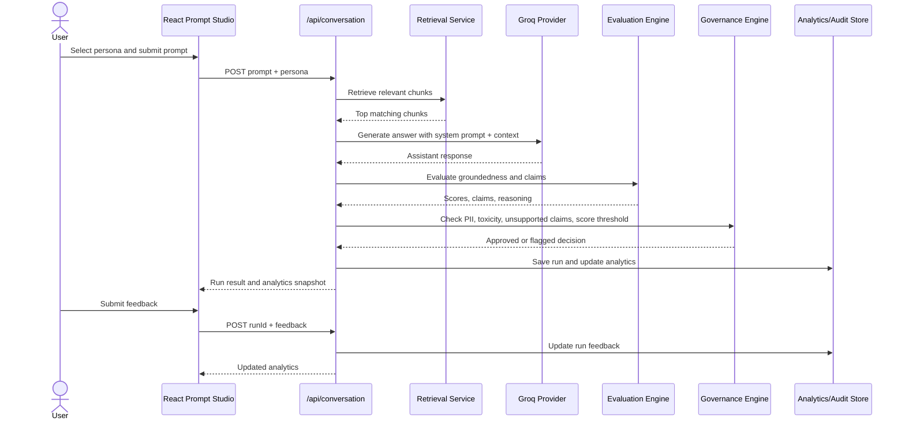
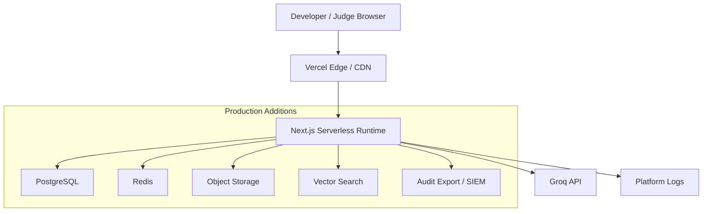

# Lumen Architecture Documentation

## High-Level Architecture



## Runtime Data Flow



## Component Responsibilities

| Component | Responsibility |
| --- | --- |
| Prompt Studio UI | User workflow, persona selection, evidence display, evaluation display, feedback |
| API Route Handler | Request validation, workflow orchestration, response formatting |
| Retrieval Service | Find relevant knowledge documents/chunks |
| Groq Provider | Generate and evaluate via Groq when configured |
| Evaluation Engine | Score groundedness, confidence, supported/unsupported claims |
| Governance Engine | Flag low groundedness, PII, toxicity, unsupported claims |
| Analytics Service | Aggregate tests, feedback, flag rate, groundedness trend |
| Session Store | MVP persistence layer |

## Provider-Agnostic LLM Layer

The frontend never calls Groq directly.

Current provider module:

```text
src/services/groq/provider.ts
```

The provider exposes:

```ts
generateAnswer(persona, prompt, retrieved)
evaluateAnswer(prompt, response, retrieved)
```

Future providers can implement the same interface:

- OpenAI
- Anthropic
- Gemini
- Local model runtime
- Multi-model evaluator

## Deployment Architecture



## Current Deployment Assumptions

- Next.js app can run locally or on Vercel.
- Environment variables provide provider credentials.
- Current MVP state is process-local.
- A single route handler orchestrates the MVP workflow.

## Production Deployment Recommendations

- Deploy frontend and route handlers on Vercel or containerized Node runtime.
- Use managed PostgreSQL for persistent state.
- Use object storage for documents and attachments.
- Use Redis for async evaluation queues and rate limiting.
- Export audit events to customer SIEM when required.
- Use secrets manager for LLM provider credentials.
- Add observability for latency, cost, errors, flags, and evaluator drift.

## Scalability Considerations

| Area | MVP | Production Direction |
| --- | --- | --- |
| Storage | In-memory | PostgreSQL |
| Retrieval | Keyword matching | Hybrid keyword + vector |
| Evaluation | Synchronous | Queue-based async for batches |
| Analytics | In-memory aggregation | SQL/materialized views |
| Providers | Groq | Multi-provider adapter |
| Governance | Deterministic rules | Policy engine + reviewer workflow |

## Failure Modes

| Failure | Handling |
| --- | --- |
| Missing `GROQ_API_KEY` | Use mock generation and heuristic evaluation |
| Empty prompt | Return HTTP 400 |
| Groq JSON parse failure during evaluation | Fall back to heuristic evaluation |
| Low groundedness | Flag for review |
| PII detected | Flag for review |

## Security Architecture

Current MVP:

- No auth
- No persistent secrets beyond environment variables
- No database
- PII detection via simple pattern matching

Production:

- SSO/SAML/OIDC
- RBAC
- Workspace-level tenant isolation
- Row-level security
- Encryption at rest and in transit
- Prompt and response redaction
- Append-only audit logs
- Provider allowlist by workspace
