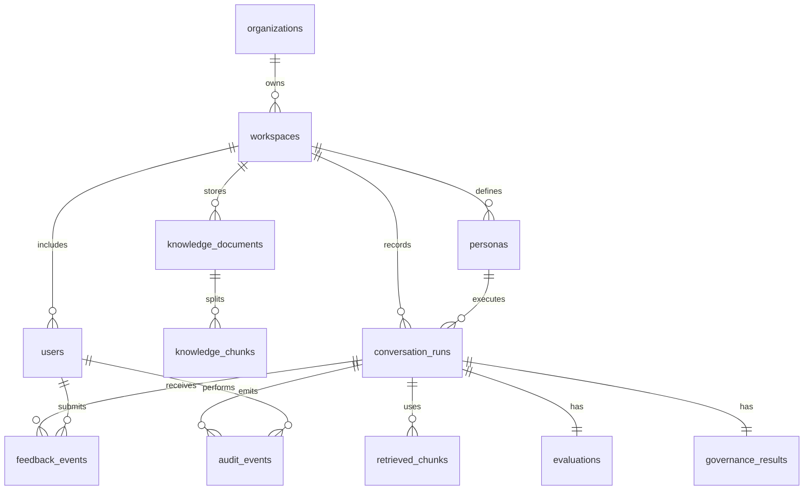

# Lumen Database Design

## Current MVP Storage

The current implementation uses an in-memory session store:

```text
src/services/analytics/store.ts
```

This keeps the MVP simple and demo-friendly, but data resets on server restart.

## Production Database Recommendation

Use PostgreSQL as the system of record.

Recommended supporting services:

- Redis for short-lived queues, rate limits, and streaming state
- Object storage for uploaded source documents
- Vector database or Postgres `pgvector` for semantic retrieval
- Analytics warehouse for long-term aggregate reporting

## Entity Relationship Diagram



## Tables

### organizations

```sql
CREATE TABLE organizations (
  id UUID PRIMARY KEY DEFAULT gen_random_uuid(),
  name TEXT NOT NULL,
  slug TEXT NOT NULL UNIQUE,
  created_at TIMESTAMPTZ NOT NULL DEFAULT now()
);
```

### workspaces

```sql
CREATE TABLE workspaces (
  id UUID PRIMARY KEY DEFAULT gen_random_uuid(),
  organization_id UUID NOT NULL REFERENCES organizations(id),
  name TEXT NOT NULL,
  environment TEXT NOT NULL DEFAULT 'sandbox',
  created_at TIMESTAMPTZ NOT NULL DEFAULT now()
);
```

### users

```sql
CREATE TABLE users (
  id UUID PRIMARY KEY DEFAULT gen_random_uuid(),
  workspace_id UUID NOT NULL REFERENCES workspaces(id),
  email TEXT NOT NULL,
  name TEXT NOT NULL,
  role TEXT NOT NULL CHECK (role IN ('admin', 'evaluator', 'reviewer', 'auditor')),
  created_at TIMESTAMPTZ NOT NULL DEFAULT now(),
  UNIQUE (workspace_id, email)
);
```

### personas

```sql
CREATE TABLE personas (
  id UUID PRIMARY KEY DEFAULT gen_random_uuid(),
  workspace_id UUID NOT NULL REFERENCES workspaces(id),
  key TEXT NOT NULL,
  name TEXT NOT NULL,
  description TEXT NOT NULL,
  system_prompt TEXT NOT NULL,
  model_provider TEXT NOT NULL DEFAULT 'groq',
  model_name TEXT NOT NULL,
  is_active BOOLEAN NOT NULL DEFAULT true,
  created_at TIMESTAMPTZ NOT NULL DEFAULT now(),
  UNIQUE (workspace_id, key)
);
```

### knowledge_documents

```sql
CREATE TABLE knowledge_documents (
  id UUID PRIMARY KEY DEFAULT gen_random_uuid(),
  workspace_id UUID NOT NULL REFERENCES workspaces(id),
  title TEXT NOT NULL,
  category TEXT NOT NULL,
  source_uri TEXT,
  version INTEGER NOT NULL DEFAULT 1,
  status TEXT NOT NULL CHECK (status IN ('draft', 'active', 'archived')),
  created_at TIMESTAMPTZ NOT NULL DEFAULT now()
);
```

### knowledge_chunks

```sql
CREATE TABLE knowledge_chunks (
  id UUID PRIMARY KEY DEFAULT gen_random_uuid(),
  document_id UUID NOT NULL REFERENCES knowledge_documents(id),
  chunk_index INTEGER NOT NULL,
  body TEXT NOT NULL,
  tags TEXT[] NOT NULL DEFAULT '{}',
  embedding VECTOR(1536),
  created_at TIMESTAMPTZ NOT NULL DEFAULT now(),
  UNIQUE (document_id, chunk_index)
);
```

If `pgvector` is not enabled, omit `embedding` and rely on keyword search until semantic retrieval is introduced.

### conversation_runs

```sql
CREATE TABLE conversation_runs (
  id UUID PRIMARY KEY DEFAULT gen_random_uuid(),
  workspace_id UUID NOT NULL REFERENCES workspaces(id),
  persona_id UUID NOT NULL REFERENCES personas(id),
  user_id UUID REFERENCES users(id),
  prompt TEXT NOT NULL,
  response TEXT NOT NULL,
  model_provider TEXT NOT NULL,
  model_name TEXT NOT NULL,
  latency_ms INTEGER NOT NULL,
  created_at TIMESTAMPTZ NOT NULL DEFAULT now()
);
```

### retrieved_chunks

```sql
CREATE TABLE retrieved_chunks (
  id UUID PRIMARY KEY DEFAULT gen_random_uuid(),
  run_id UUID NOT NULL REFERENCES conversation_runs(id) ON DELETE CASCADE,
  chunk_id UUID REFERENCES knowledge_chunks(id),
  title TEXT NOT NULL,
  excerpt TEXT NOT NULL,
  relevance NUMERIC(5,2) NOT NULL,
  rank INTEGER NOT NULL
);
```

### evaluations

```sql
CREATE TABLE evaluations (
  id UUID PRIMARY KEY DEFAULT gen_random_uuid(),
  run_id UUID NOT NULL UNIQUE REFERENCES conversation_runs(id) ON DELETE CASCADE,
  groundedness INTEGER NOT NULL CHECK (groundedness BETWEEN 0 AND 100),
  confidence INTEGER NOT NULL CHECK (confidence BETWEEN 0 AND 100),
  supported_claims JSONB NOT NULL DEFAULT '[]',
  unsupported_claims JSONB NOT NULL DEFAULT '[]',
  reasoning TEXT NOT NULL,
  evaluator_model TEXT,
  created_at TIMESTAMPTZ NOT NULL DEFAULT now()
);
```

### governance_results

```sql
CREATE TABLE governance_results (
  id UUID PRIMARY KEY DEFAULT gen_random_uuid(),
  run_id UUID NOT NULL UNIQUE REFERENCES conversation_runs(id) ON DELETE CASCADE,
  status TEXT NOT NULL CHECK (status IN ('approved', 'flagged')),
  reviewer_status TEXT NOT NULL CHECK (reviewer_status IN ('auto-approved', 'needs-review', 'approved', 'rejected')),
  flags JSONB NOT NULL DEFAULT '[]',
  summary TEXT NOT NULL,
  created_at TIMESTAMPTZ NOT NULL DEFAULT now()
);
```

### feedback_events

```sql
CREATE TABLE feedback_events (
  id UUID PRIMARY KEY DEFAULT gen_random_uuid(),
  run_id UUID NOT NULL REFERENCES conversation_runs(id) ON DELETE CASCADE,
  user_id UUID REFERENCES users(id),
  feedback TEXT NOT NULL CHECK (feedback IN ('positive', 'negative')),
  note TEXT,
  created_at TIMESTAMPTZ NOT NULL DEFAULT now()
);
```

### audit_events

```sql
CREATE TABLE audit_events (
  id UUID PRIMARY KEY DEFAULT gen_random_uuid(),
  workspace_id UUID NOT NULL REFERENCES workspaces(id),
  run_id UUID REFERENCES conversation_runs(id),
  actor_user_id UUID REFERENCES users(id),
  event_type TEXT NOT NULL,
  payload JSONB NOT NULL DEFAULT '{}',
  created_at TIMESTAMPTZ NOT NULL DEFAULT now()
);
```

## Indexing Strategy

```sql
CREATE INDEX idx_runs_workspace_created_at
  ON conversation_runs (workspace_id, created_at DESC);

CREATE INDEX idx_runs_persona_created_at
  ON conversation_runs (persona_id, created_at DESC);

CREATE INDEX idx_evaluations_groundedness
  ON evaluations (groundedness);

CREATE INDEX idx_governance_status
  ON governance_results (status, reviewer_status);

CREATE INDEX idx_feedback_run
  ON feedback_events (run_id);

CREATE INDEX idx_audit_workspace_created_at
  ON audit_events (workspace_id, created_at DESC);
```

If semantic retrieval is enabled:

```sql
CREATE INDEX idx_knowledge_chunks_embedding
  ON knowledge_chunks
  USING ivfflat (embedding vector_cosine_ops);
```

## Data Retention

Recommended defaults:

| Data | Retention |
| --- | --- |
| Audit events | 1-7 years depending on customer policy |
| Conversation runs | 180-365 days |
| Evaluation results | Same as conversation runs |
| Knowledge document versions | Until explicitly archived |
| Feedback events | Same as conversation runs |

## Security Requirements

- Encrypt data at rest.
- Encrypt traffic in transit.
- Partition data by workspace/tenant.
- Apply row-level security for multi-tenant deployments.
- Avoid storing secrets in prompts or logs.
- Redact PII where possible.
- Keep audit events append-only.

## Migration Path From MVP

1. Replace `sessionStore.runs` with repository interfaces.
2. Add Postgres connection and migrations.
3. Persist personas and documents.
4. Persist every conversation run and related evaluation/governance records in one transaction.
5. Add query APIs for history, review queue, and analytics.
6. Move analytics from in-memory aggregation to SQL views/materialized views.
