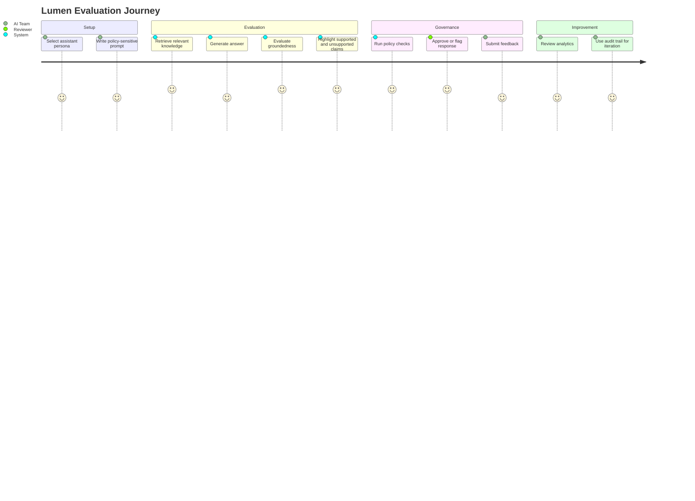
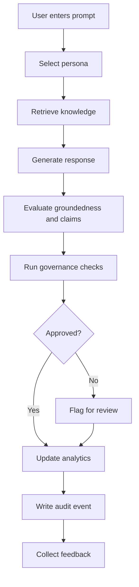
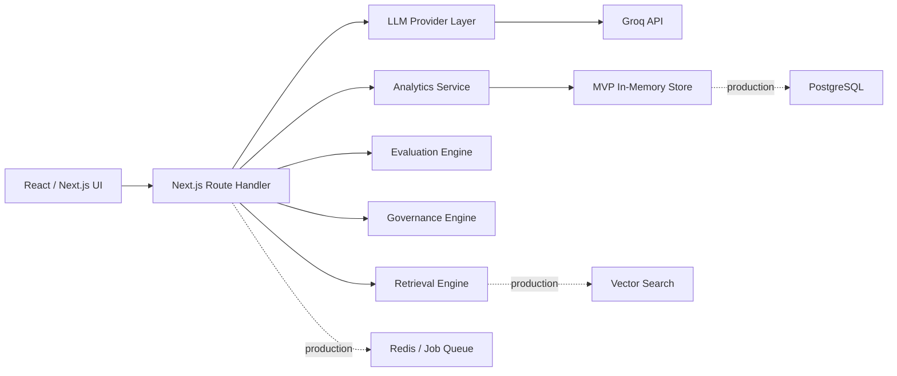

# Lumen Solution Design Document

This document is intentionally concise and designed to fit within a maximum five-page submission format when exported.

## 1. Business Understanding

Enterprises are adopting AI assistants across functions such as HR, IT, Security, Legal, and Customer Support. The problem is no longer only response generation. The harder problem is trust, governance, and continuous improvement.

Teams need to know:

- Whether an assistant response is grounded in approved knowledge
- Which source documents supported the answer
- Which claims were unsupported
- Whether the answer violates policy
- Whether a response should be approved, reviewed, or blocked
- How assistant quality changes over time

Lumen addresses this as an AI Conversation Studio: a workspace where teams can test assistants before production deployment and inspect the reasoning, evidence, governance, and quality metrics behind every response.

## 2. Customer Journey

## 3. Workflow

## 4. High-Level Architecture

## 5. Design Decisions

| Decision | Rationale |
| --- | --- |
| One complete workflow | The challenge values depth; a single end-to-end journey is more convincing than many shallow pages. |
| Provider abstraction | Future providers should not require frontend changes. |
| Keyword retrieval for MVP | Fast to implement, explainable, deterministic, and easy to demo. |
| Mock fallback without API key | The product remains testable even without external credentials. |
| In-memory store | Good for MVP speed; production DB design is documented separately. |
| Explainability-first UI | Evidence, evaluation, governance, and analytics are visible in one workflow. |
| Strict grayscale Liquid Glass UI | Keeps the product calm, premium, and enterprise-oriented. |

## 6. Assumptions

- The MVP is evaluated in a sandbox environment.
- Authentication and multi-tenancy are out of scope for the first working slice.
- Mock policy documents are acceptable for demonstrating retrieval and evaluation.
- A Groq API key may or may not be available during judging.
- Human reviewers need transparent evidence before approval decisions.

## 7. Trade-offs

| Trade-off | Benefit | Cost |
| --- | --- | --- |
| In-memory storage | Fast MVP implementation | Data resets on restart |
| Keyword retrieval | Explainable and simple | Lower recall than semantic search |
| Synchronous pipeline | Easy to understand and demo | Batch evaluations may need async queues |
| Rule-based governance | Predictable | Less nuanced than a policy engine |
| Single-screen workflow | Fast customer journey | Secondary pages are not fully implemented |

## 8. Scalability Plan

Short term:

- Persist runs, evaluations, feedback, and audit events in PostgreSQL.
- Add query APIs for history and governance review.
- Add vector search for better knowledge grounding.

Medium term:

- Add authentication, RBAC, and multi-tenant workspaces.
- Add human review queues with approve/reject workflows.
- Add prompt versioning and evaluation datasets.
- Add cost, latency, and provider-level analytics.

Long term:

- Multi-provider comparison across Groq, OpenAI, Anthropic, Gemini, and local models.
- Deployment approval gates.
- Enterprise audit exports.
- Continuous evaluation monitors for production assistants.

## 9. Security

MVP security is limited because the product currently runs as a local/demo app. Production security should include:

- SSO/OIDC or SAML authentication
- Role-based access control
- Tenant isolation and row-level security
- Encryption in transit and at rest
- Secret management for model provider keys
- PII redaction and policy checks
- Append-only audit logs
- SIEM export for regulated customers

## 10. Roadmap

| Phase | Scope |
| --- | --- |
| MVP | Prompt, retrieval, generation, evaluation, governance, feedback, analytics |
| Phase 1 | PostgreSQL, history APIs, review queue, better analytics |
| Phase 2 | Auth, RBAC, workspaces, document upload, vector retrieval |
| Phase 3 | Prompt versioning, datasets, human approvals, multi-provider comparison |
| Phase 4 | Production monitors, cost analytics, deployment gates, enterprise integrations |

## 11. Success Criteria

A judge or customer should be able to complete this journey in under five minutes:

1. Select an assistant persona.
2. Enter a policy-sensitive prompt.
3. View retrieved knowledge.
4. Generate an answer.
5. Inspect groundedness and evidence.
6. Review governance status.
7. Submit feedback.
8. See analytics update.

If this journey is clear, Lumen demonstrates its core value: helping organizations trust AI assistants through explainability and governance.
